

<!-- 여기는 제목 -->

# DDC 2023

[Design Day] 23.01.29 [Tstory](https://100designer.tistory.com/6)

### 김리연 [롱블랙]

대담함과 섬세함, 롱블랙이  경험을 설계하는 법

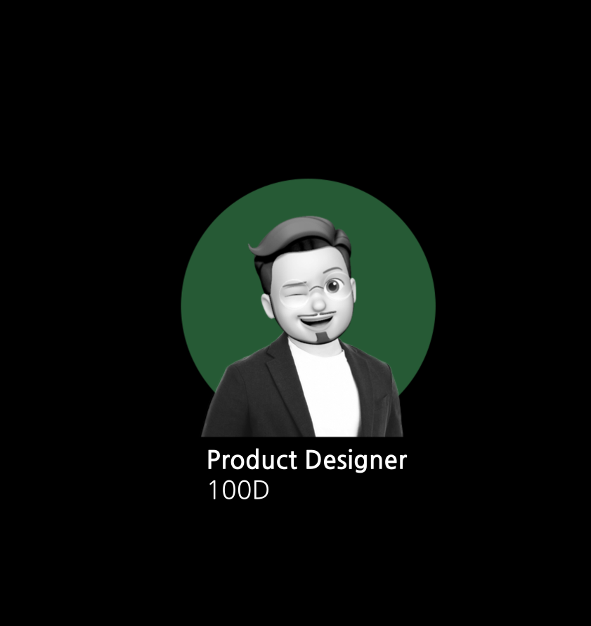

---

# 프로덕트 메이킹 스토리

- 대담함

- 섬세함

- 그리고 콘텐츠

- 톺아보기

---

# Long Black

> 생소한 이름 롱블랙, 커피에 관심을 가진 사람에게
> **어느 정도 귀에 익숙한 커피의 한 종류** > _익숙한 아메리카노와 차이는_
> 물과 에스프레소중 어느 것이 잔에 먼저 들어가냐...
>
> 즉 섬세한 취향의 소유자를 위한 미디어라는 의미

---

# 대담함 - Brave

### 남들과 다른 한 끗

- 시간의 강제성 [24H]

- 지금 읽지 않으면 읽을 수 없다.

- 밀도있는 인사이트 컨텐츠 한개

- 쌓이지 않도록 습관을 도운다.

---

# 섬세함 - Delicacy

### 3가지 요소

- 콘텐츠

- 연결

- 공간경험

---

# 콘텐츠 - Contents

- 밀도있는 콘텐츠

- 서비스의 본질을 잃지 않는 것

- 포장은 본질이후, 고민하는 것

---

# 연결 - Connect

- [online] 롱블랙 Slack 커뮤니티

- [offline] 롱블랙 커피챗

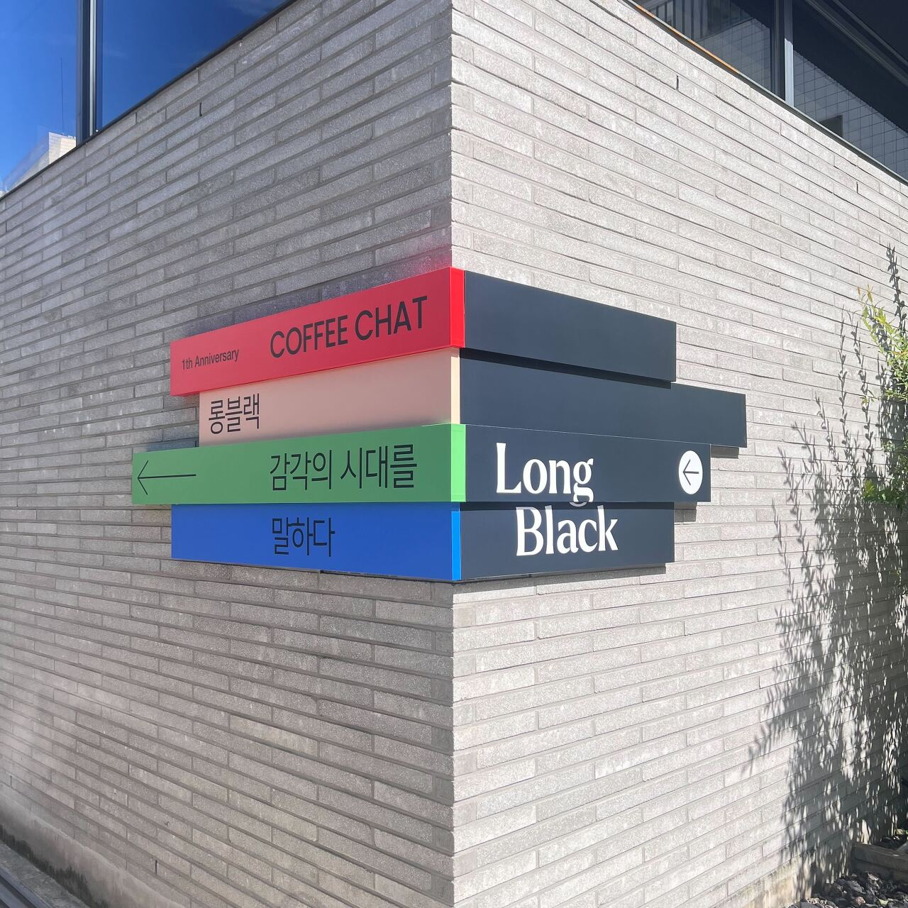

---

# 공간 경험 - Experience

- 검색하는 순간

- 마주하는 순간

- 머무는 순간

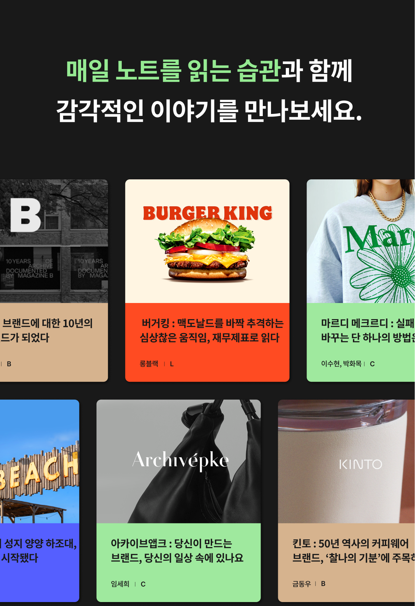

---

## 강제성

24시간 후에 사라지는 콘텐츠
'제한적인 서비스'로 통한 미루지 않는
자연스러운 데드라인 효과(Deadline effect)적인
습관 조정

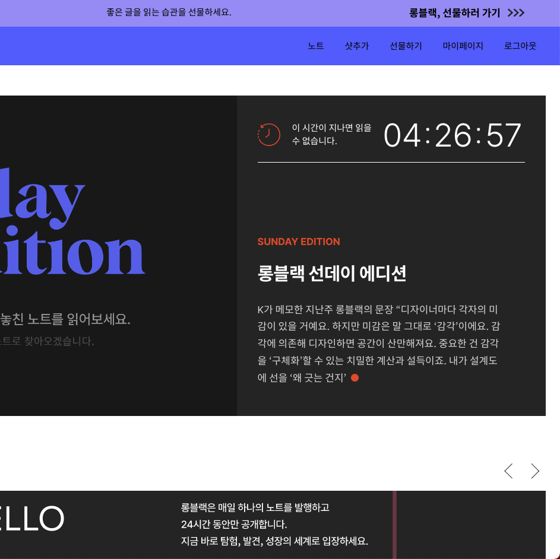

---

# 1년 만에 월간활성사용자(MAU) 13만명

> 역발상 전략으로 강제성을 부여한 구독서비스의 성공
>
> -- 2021년 9월 론칭

---

## 일관성

커피라는 컨셉의 일관성을 위해
혜택은 스탬프로
별점은 커피콩으로 표현해서
브랜드 아이덴티티를 유지한다.
모든 경험을 커피로 공감을 형성

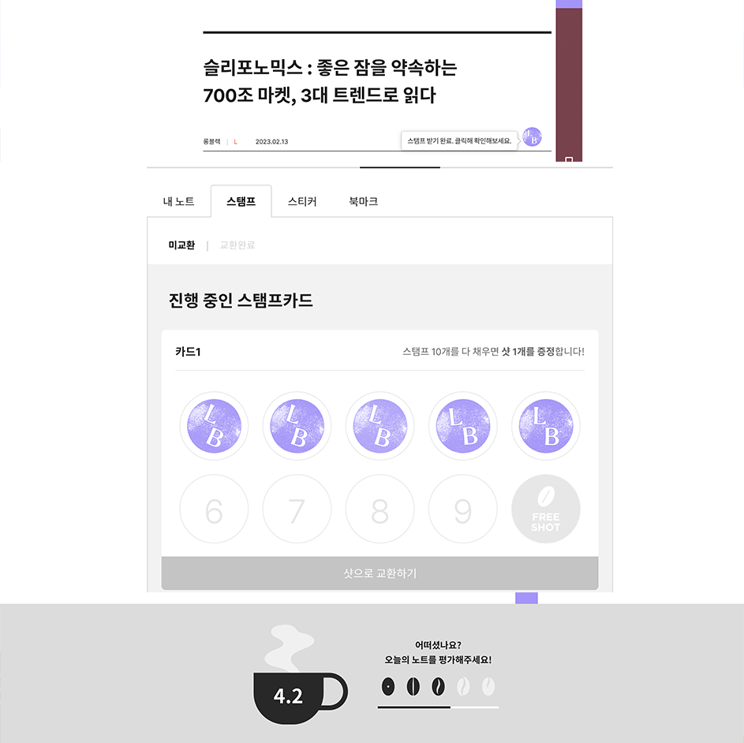

---

# Growth Hacking

> 성장을 뜻하는 Growth와 Hacking이 결합된 단어로 고객의 반응에 따라 제품 및 서비스를
> 수정해 제품과 시장의 궁합(PMF) 높이는 것을 의미함.
> 조금더 간단히 말하자면 개발과정에 걸쳐 마케팅 아이디어를 제품에 녹여내는 전략
>
> -- 출처 : 위키피디아

---

## 24H 링크 공유

무료 링크 (24H) →
Growthhacking →
고객이 세일즈맨이 됨

무료 링크에서 15% 읽으면
광고 팝업이 나옴 →
플랫폼 광고를 연결해서 홍보 비용 줄임

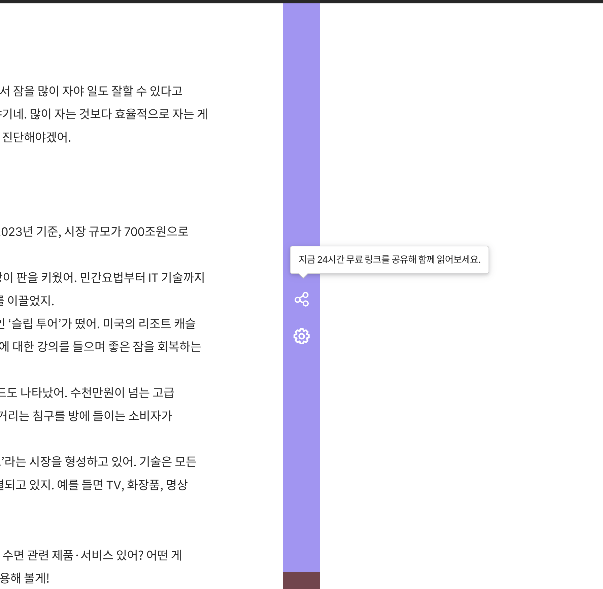

---

# UX UI 톺아보기

> 사용자 전체적 경험 설계를 하는 일
> UX = 행동 / UI = 표현

---

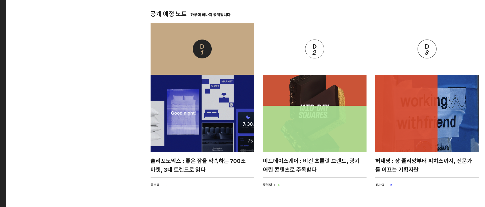

---

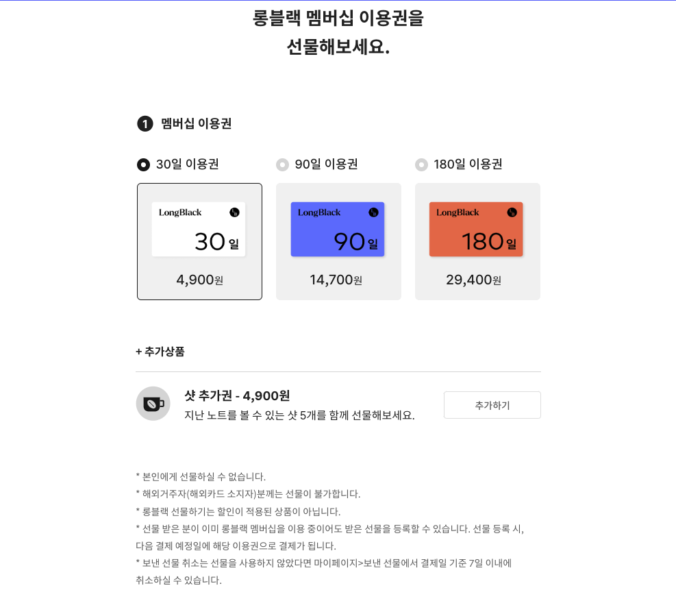

---

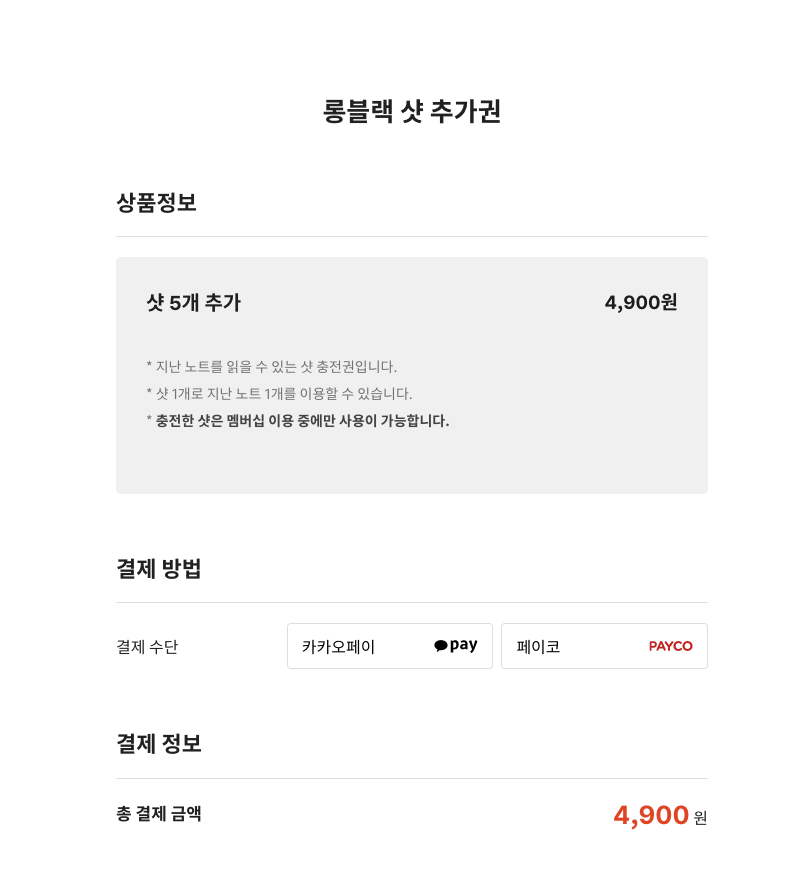

---

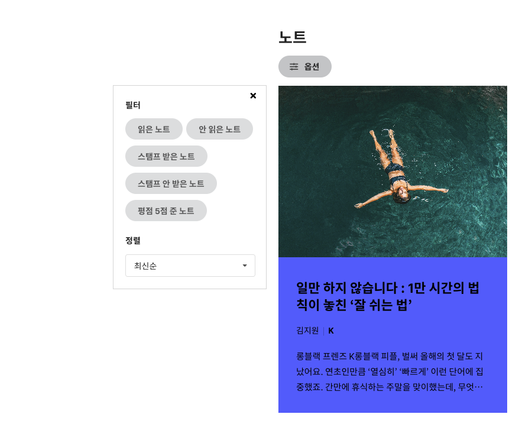

---

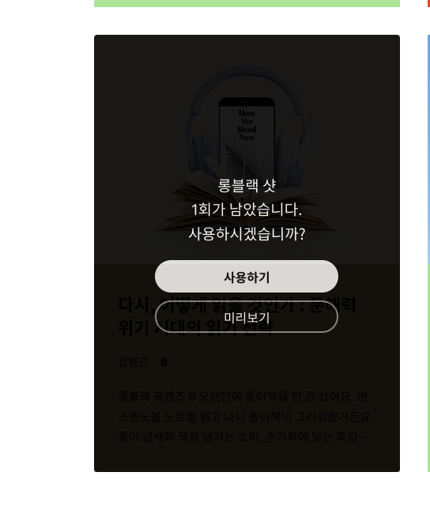

---

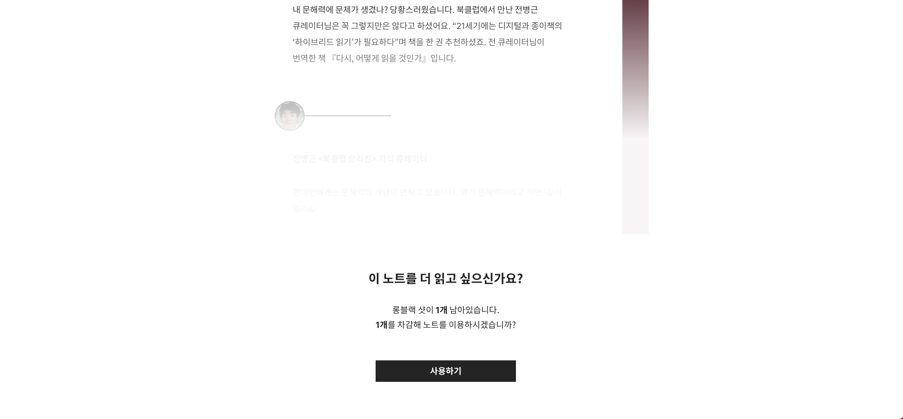

---

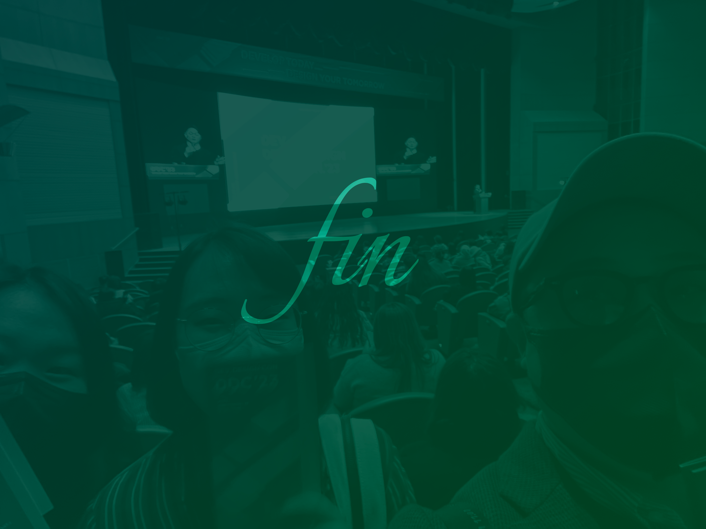
